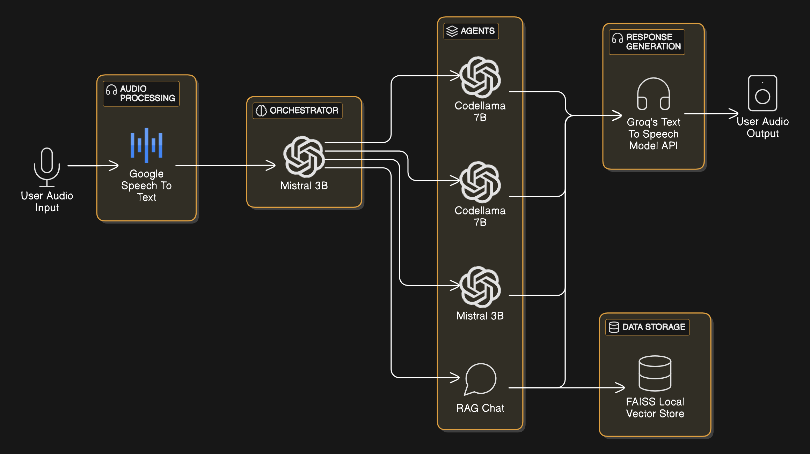
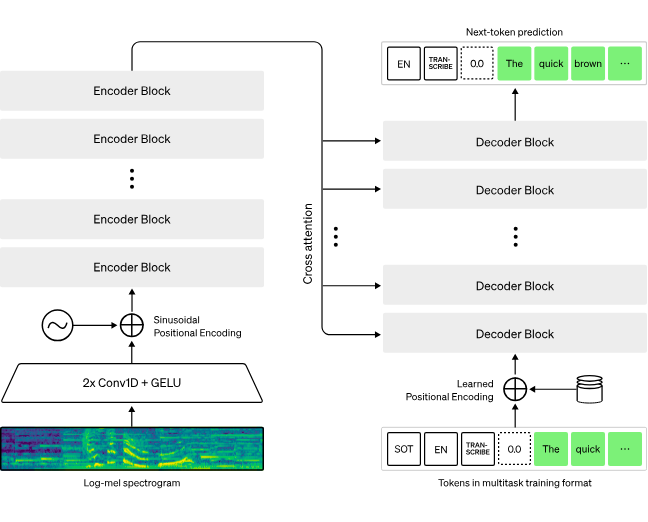
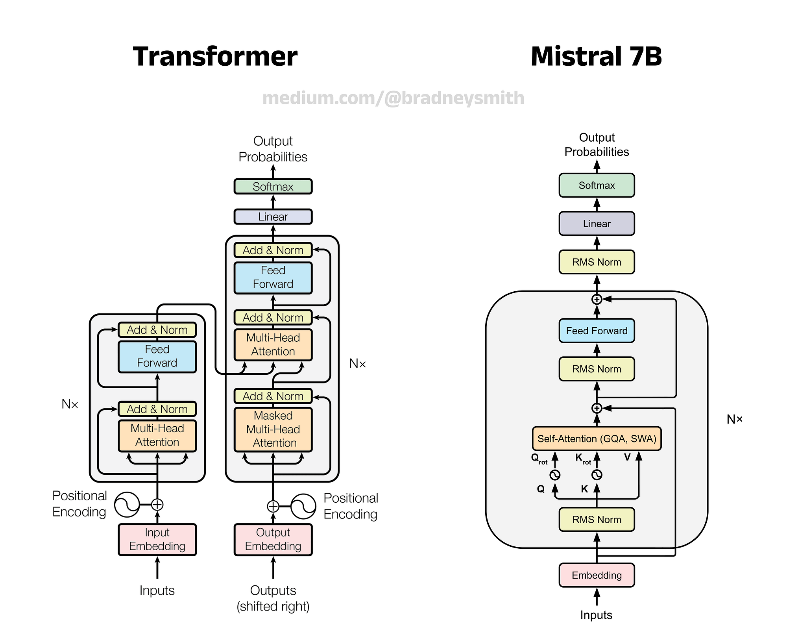
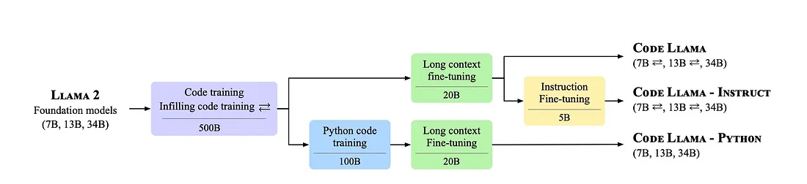
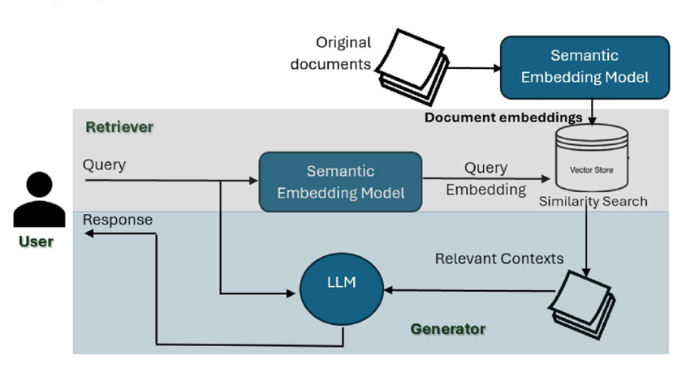

# PULSE
## Team
### Mentors
- Konatham Nagamukesh
- Vishal Kamath
- Hayden Soares
### Mentees
- H S Jayanth
- Raunil Singh
- Dev Prajapati

## Aim
To design and implement a modular voice-based assistant capable of performing automation tasks, executing context-aware responses using retrieval-augmented generation (RAG), and supporting naturalistic conversation with speech I/O, all tailored for a college environment.

## Introduction
Voice-based AI assistants have transformed human-computer interaction by enabling intuitive access to services and automation. However, commercial solutions are resource-intensive and often closed-source. PULSE explores the possibility of building a decentralized, modular, and technically competent voice assistant leveraging LLMs, RAG pipelines, and speech APIs to address the productivity needs of students.

## Literature Survey
### Speech-to-Text and Text-to-Speech Systems
Google’s Speech-to-Text API is among the most accurate and low-latency offerings in production, based on WhisperNet-like architectures combining convolutional layers and transformer encoders with Connectionist Temporal Classification (CTC) decoders. These are covered extensively in literature, notably in “Whisper: Robust Speech Recognition via Large-Scale Weak Supervision” by Radford et al., OpenAI (2022), and “Conformer: Convolution-augmented Transformer for Speech Recognition” by Gulati et al., Google Research (2020).

### Transformer Language Models
Mistral and CodeLlama represent the evolution of open-source transformer models tuned for task specialization. Mistral’s architecture follows decoder-only transformers with rotary positional embeddings and sparse attention routing, making it efficient yet capable of general understanding across domains. Thus, it builds off of “Attention is All You Need” (Vaswani et al., 2017) and subsequent derivatives like LLaMA and MPT.

CodeLlama is a finetuned variant of LLaMA-2 trained on code corpora and instruction-tuning paradigms. It is optimized for high-fidelity completions and chatting and can be traced to "Llama 2: Open Foundation and Fine-Tuned Chat Models" (Touvron, et al., 2023).

### Retrieval-Augmented Generation
RAG is a paradigm that enhances LLMs by grounding them in retrieved knowledge. The approach combines vector search (typically via FAISS or other approximate nearest neighbor methods) with prompt-based augmentation. Key literature includes “Retrieval-Augmented Generation for Knowledge-Intensive NLP Tasks” (Lewis et al., Facebook AI, 2020) and “Dense Passage Retrieval for Open-Domain Question Answering” (Karpukhin et al., 2020).

## Technologies Used
- WhisperNet STT Model: Real-time audio transcription.
- Groq TTS API: Converts assistant responses to natural-sounding speech.
- Mistral 3B: Multi-role LLM used for orchestration logic, and powering the RAG agent.
- CodeLlama 7B: Specialized in code and bash script generation.
- FAISS: High-speed vector similarity search used in the RAG pipeline.
- RAG Chat: Custom-built QA system for document-based question answering.
- Multimodal Parser: Extracts content from formats like PDFs, PPTs, Markdown, etc., for embedding.

## Methodology
### System Architecture

1. User Input: Microphone captures the user's voice.

2. Audio Processing: WhisperNet STT transcribes spoken commands.

3. Orchestration Layer: Mistral interprets intent and routes to appropriate downstream agents.

4. Agent Dispatch:

- Code Agent (CodeLlama): For writing simple code snippets.
- Bash Agent (CodeLlama): For generating shell commands.
- RAG Agent (Mistral): For answering queries using contextual retrieval.
5. Output Rendering: Groq TTS synthesizes the response to audio.

### Model Architecture
#### Whisper STT Model
Whisper STT Model

- WhisperNet- usess deep neural speech recognizers
- Architecture: Convolutional front-end + transformer-based encoder-decoder
- Features: Real-time streaming, multilingual, noise robustness, word alignment
- Use: Entry point for user interaction enabling continuous voice input

#### Mistral 3B
- Architecture: Decoder-only dense transformer with rotary positional embeddings
- Size: 3B parameters
- Tokenizer: SentencePiece
- Pretraining Data: Web, coding, instructions; fine-tuned with alignment and RLHF
- Roles in PULSE:
    - Task classification using zero-shot prompting
    - RAG response generation using embedded documents
- Special Note: Used in both orchestrator and generative roles (unified LLM framework)

#### Codellama 7B
- Architecture: Decoder-only LLaMA-2 derived transformer
- Tokenizer: Byte Pair Encoding (BPE)
- Training: Source code (C/C++, Python, Bash); instruction-tuned
- Roles in PULSE:
    - Code agent for programming task completion
    - Bash agent for CLI automation
- Execution Strategy: Prompt-based generation with deterministic control tokens

#### RAG Pipeline (Mistral-Powered)
- Parser: Extracts structured text from PDFs, DOCX, PPT, etc.
- Chunking: 512-token windows with overlap
- Embedding: MiniLM via SentenceTransformers
- Retrieval: FAISS flat cosine similarity index
- Response Generation:
- Mistral receives [Top-k Chunks + User Query]
- Generates grounded answers with source awareness

## Results
- Achieved a working smart speech driven, agent powered RAG system.
- Multiple agents to execute some basic tasks.
- RAG to parse a directory of documents, pdfs, presentations, slides decks, etc. and can chat fairly well with them.
- STT/TTS works fairly clearly, when using proper enunciation. Can interpret uncommon words from specific contexts as well.

## Conclusion
PULSE demonstrates the feasibility of a robust, real-time AI assistant using speech pipelines, retrieval-based question answering, and open-source LLMs. With each agent modularized and tied to task-specialized models like CodeLlama and Mistral, the system achieves some accuracy and speed. The architecture reflects modern advances in transformer models and demonstrates how STT and TTS stacks can be integrated with intelligent task routing to create efficient, human-friendly systems.

## Future Scope
- Frontend Integration: Web-based interface for visual context and accessibility
- Bash Agent Contextualization: Include Linux man pages as prompt context
- Dockerization: Modular containers with REST APIs
- More Agents: schedule assistant, web query handler, etc.
